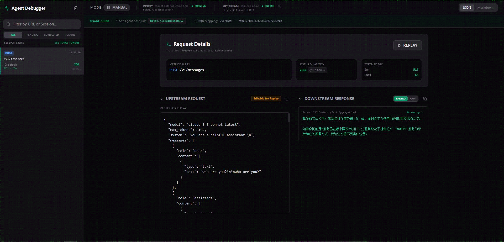

# LLM Agent Debugger Proxy

[简体中文](./README.md) | English

A specialized debugging proxy server designed for LLM Agent developers. It acts as a transparent middle layer, allowing you to observe, intercept, modify, and visualize all interactions between your Agent and LLM APIs in real-time.


*Main Interface: Real-time monitoring, interception editing, and streaming output visualization.*

## Core Features

- **Transparent Proxy**: Forwards all HTTP requests and responses while preserving original paths and headers.
- **Step-through Debugging**: "Manual Mode" intercepts requests before they are sent upstream, allowing you to modify the payload.
- **Edit & Replay**: Edit any historical request and resend it to quickly reproduce issues or test different prompts.
- **Real-time SSE Visualization**: Displays Server-Sent Events (SSE) streaming responses in real-time, allowing you to watch the model's output as it happens.
- **Token & Cache Tracking**: Accurately parses token usage for OpenAI/Anthropic protocols, including **Cache Hit** and **Cache Creation** metrics.
- **Multi-dimensional Views**: Provides JSON tree views and Markdown rendering for easy inspection of structured data and long-form text.
- **Data Persistence**: Uses SQLite to record all historical requests, with support for filtering by URL or Session ID.

## Tech Stack

### Backend
- **Runtime**: Node.js (TypeScript)
- **Framework**: **Express** - Handles HTTP proxy logic and static asset serving.
- **Real-time**: **Socket.io** - Enables bi-directional real-time communication between the server and UI.
- **Database**: **Better-SQLite3** - High-performance local storage for interaction logs.
- **Proxy**: Custom streaming proxy engine with full support for SSE forwarding and parsing.

### Frontend
- **Framework**: **React 18** + **Vite**
- **Styling**: **Tailwind CSS** - Responsive, modern dark-themed design.
- **Animation**: **Framer Motion** - Smooth animations for list entries and state transitions.
- **Icons**: **Lucide React** - Consistent iconography.
- **Components**: 
  - `react-json-view`: Structured JSON previewing.
  - `react-markdown`: Real-time rendering of model-generated Markdown.

## Quick Start

### 1. Configure Environment

Create a `.env` file in the root directory (refer to `.env.example`):

```env
# Port the proxy server listens on (default 3000)
PORT=3000

# Target upstream URL (e.g., local LLM proxy or OpenAI API)
UPSTREAM_URL="http://127.0.0.1:8832"

# Whether to enable Auto Mode by default (true/false)
AUTO_MODE="false"

# (Optional) Bypass proxy URL
BYPASS_URL=""
```

### 2. Run Locally

```bash
# Clone the repository
git clone https://github.com/leemojiang/LLM-Agent-Debugger
cd LLM-Agent-Debugger

# Install dependencies
npm install

# Start the development server
npm run dev
```

Visit `http://localhost:3000` to access the debugger interface.

### 3. Configure Your Agent

Point your Agent or LLM client's API Base URL to this proxy server:
`http://localhost:3000`

## Usage Guide

- **Manual Mode**: New requests appear as "Pending". Click a request, modify the JSON in the middle panel, and click **RELEASE REQUEST** to send it.
- **Replay**: Select any historical request, modify its payload, and click the **REPLAY** button to initiate a new copy of the request.
- **Token Monitoring**: View detailed token consumption, including input, output, and cache details, in the right-hand details panel.
- **Visualization Toggle**: Switch between **JSON** and **Markdown** modes in the top bar. Markdown mode is ideal for viewing model-generated responses.

## Deployment (Docker)

```bash
docker build -t llm-agent-debugger .
docker run -p 3000:3000 --env-file .env llm-agent-debugger
```

## License

MIT License
